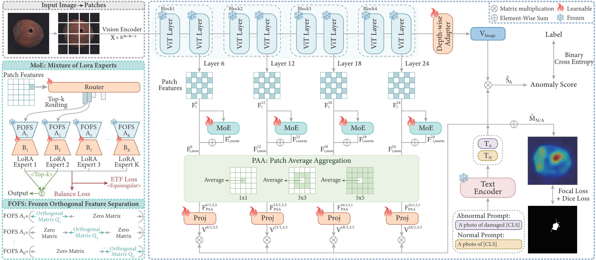
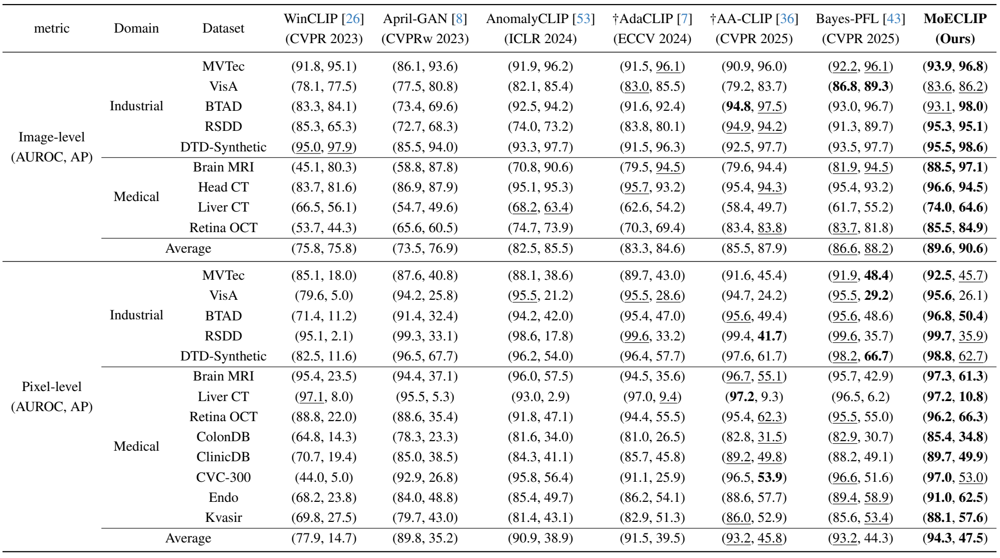
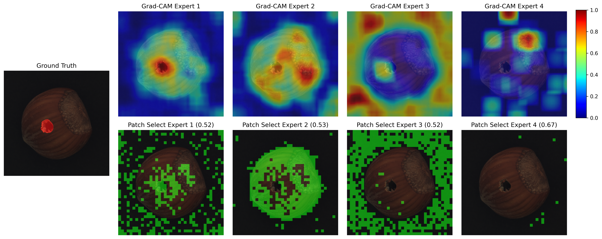
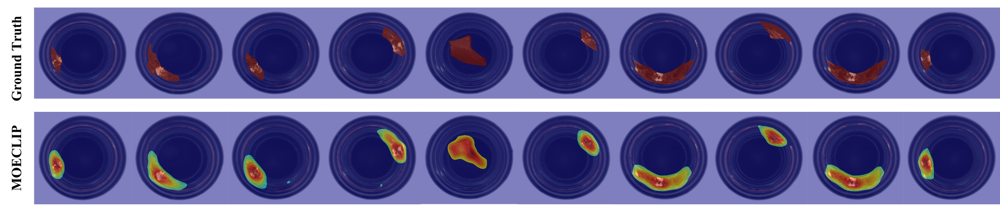
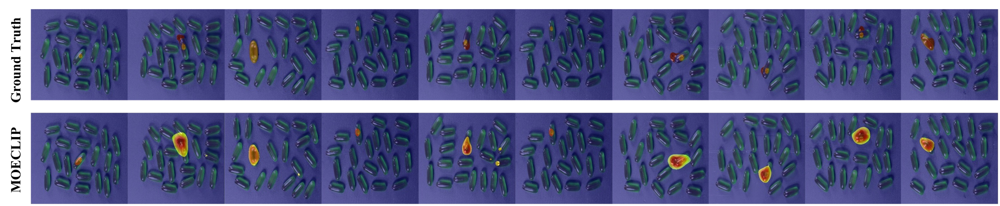
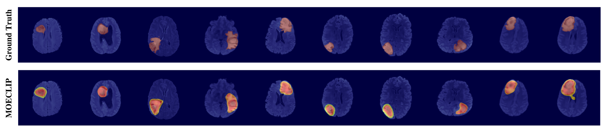
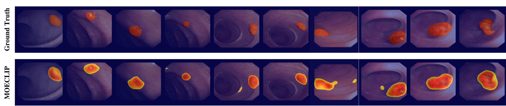

# MoECLIP reproduction and region-guided RGB-T extension
<p align="center">
  <a href="https://openaccess.thecvf.com/content/CVPR2026/html/Park_MoECLIP_Patch-Specialized_Experts_for_Zero-shot_Anomaly_Detection_CVPR_2026_paper.html"></a>
  <a href="https://arxiv.org/abs/2603.03101"></a>
</p>

This repository started from the authors' released PyTorch implementation of:

> **MoECLIP: Patch-Specialized Experts for Zero-shot Anomaly Detection**
>
> *CVPR 2026*

It now also contains an independently audited released-code reproduction and a
research extension for category-held-out RGB-thermal anomaly detection on
MulSen-AD. The original `train.py`/`test.py` pathway remains available; the
MulSen work uses separate `train_mulsen.py`/`evaluate_mulsen.py` entry points.

## Repository tracks

- **Upstream MoECLIP:** the released RGB architecture and benchmark workflow.
- **Released-code reproduction:** observed runs and paper/code caveats are in
  [`RESULTS_SUMMARY.md`](RESULTS_SUMMARY.md). They are not presented as proof of
  exact paper-specification fidelity.
- **Region-guided RGB-T extension:** the frozen D-v1.1 architecture, leakage-safe
  protocol, and detailed research record are in
  [`RGBT_MULSEN_PLAN.md`](RGBT_MULSEN_PLAN.md).
- **Interview summary and results:** see
  [`RGBT_MULSEN_FINAL.md`](RGBT_MULSEN_FINAL.md) and the tracked
  [`results/mulsen/`](results/mulsen/README.md) artifacts.

The D-v1.1 extension keeps LoRA experts on RGB CLIP tokens and uses RGB SLIC plus
full-grid thermal attention only to condition patch routing. Thermal auxiliary
classification, reliability gating, segment-aware PAA, alignment loss, and CLS
conditioning are outside the frozen primary experiment.

## Abstract
&nbsp;&nbsp;The CLIP model's outstanding generalization has driven recent success in Zero-Shot Anomaly Detection (ZSAD) for detecting anomalies in unseen categories. 
The core challenge in ZSAD is to specialize the model for anomaly detection tasks while preserving CLIP's powerful generalization capability. 
Existing approaches attempting to solve this challenge share the fundamental limitation of a patch-agnostic design that processes all patches monolithically without regard for their unique characteristics. 
To address this limitation, we propose \textbf{MoECLIP}, a Mixture-of-Experts (MoE) architecture for the ZSAD task, which achieves patch-level adaptation by dynamically routing each image patch to a specialized Low-Rank Adaptation (LoRA) expert based on its unique characteristics.
Furthermore, to prevent functional redundancy among the LoRA experts, we introduce (1) Frozen Orthogonal Feature Separation (FOFS), which orthogonally separates the input feature space to force experts to focus on distinct information, 
and (2) a simplex equiangular tight frame (ETF) loss to regulate the expert outputs to form maximally equiangular representations. 
Comprehensive experimental results across 14 benchmark datasets spanning industrial and medical domains demonstrate that MoECLIP outperforms existing state-of-the-art methods.

## The framework of MoECLIP

&nbsp;&nbsp;MoE is integrated into multiple layers of the CLIP Vision Encoder, enabling dynamic expert routing for each image patch to learn patch-specific representations for ZSAD. Within each MoE, FOFS enforces expert specialization by orthogonally separating the feature space and ETF loss further enhances expert diversity by maximizing the equiangular separation of expert outputs. PAA then aggregates the refined patch features across multiple scales to capture anomalies of different sizes.MoE is integrated into multiple layers of the CLIP Vision Encoder, enabling dynamic expert routing for each image patch to learn patch-specific representations for ZSAD. Within each MoE, FOFS enforces expert specialization by orthogonally separating the feature space and ETF loss further enhances expert diversity by maximizing the equiangular separation of expert outputs. PAA then aggregates the refined patch features across multiple scales to capture anomalies of different sizes.

## Upstream quick start
### 1. Installation  
```bash
cd MoECLIP
conda create -n moeclip python=3.10.18 -y  
conda activate moeclip  
pip install -r requirements.txt  
```

### 2. Dataset & Path
Download the dataset:

* Industrial Domain:
[MVTec](https://docs.google.com/uc?export=download&id=1JkzLzwP4-sGHkPubeQplazX-CizuuaEw), [VisA](https://docs.google.com/uc?export=download&id=1kNn07-KcISquckAm209ZIecGGrjdi8Ph), [BTAD](https://docs.google.com/uc?export=download&id=1nB3wlkHKUiLpMJFCqCxgGTgkN0kcfgLp), [RSDD](https://docs.google.com/uc?export=download&id=1EiYoVE9weICu4N66bscZp8dFpyE0a3LC), [DTD-Synthetic](https://docs.google.com/uc?export=download&id=1Ej1LUiTLB6e55EXVS7HR6VIP0IDEcR-S)

* Medical Domain:
[BrainMRI](https://docs.google.com/uc?export=download&id=1xPuHEenVPAyZe7ZsQElACkY6QBmiDQ1E), [HeadCT](https://docs.google.com/uc?export=download&id=1bxv22XWNqY7D4JdbANtPauDxkEiVlBLy), [LiverCT](https://docs.google.com/uc?export=download&id=1AfelY6jIde5pn6YblyRhRif5net_WLVp), [RetinaOCT](https://docs.google.com/uc?export=download&id=1UH2QtPy9M9-U8SaPVxZJTBSzSWLbfAkm), [ColonDB](https://docs.google.com/uc?export=download&id=1hlRejL0XHxBFVy0xf8RRg9vpdSLqGPBm), [ClinicDB](https://docs.google.com/uc?export=download&id=1bgcfV2Fjpe5YhDe78zHNFqagImF-TNqy), [CVC-300](https://docs.google.com/uc?export=download&id=1u0QHmoeCP0nKYVB0CHAuxnQDResXQmhP), [Endo](https://docs.google.com/uc?export=download&id=1ixNCD7VH10reO18L685UZh_kZjXVhz_m), [Kvasir](https://docs.google.com/uc?export=download&id=1hvrXW8uOo8_UuOKL-SjurhwRYRI8Bekq)

Please update the "BASE_PATH" in ```./dataset/constants``` to match your data directory
To run the code, download the OpenCLIP [ViT-L-14-336px](https://drive.google.com/file/d/1d5iKW1ojGpMkeobbxNd9h_QG27xLWuKZ/view?usp=drive_link) weights and place them in the ```./model/``` directory


### 3. Training & Evaluation
```bash
# training
python train.py
# evaluation
python test.py
# (Optional) bash script for training and evaluating all the datasets
bash scripts.sh
```

## MulSen-AD RGB-T workflow

MulSen-AD data is not redistributed. Follow the audited dataset/protocol notes
and PowerShell commands in [`RGBT_MULSEN_PLAN.md`](RGBT_MULSEN_PLAN.md). Frozen
development commands and portable configs are recorded in
[`results/mulsen/development/`](results/mulsen/development/README.md). Final
commands/results will be added only after the frozen-tag refits are run.

## Comparison with State-of-the-art methods


&nbsp;&nbsp;**Comparison with state-of-the-art methods across industrial and medical domains under the ZSAD setting**. The symbol † indicates results obtained from models re-trained under our setting. The best performance is in **bold** and the second-best is <ins>underlined</ins>.

## Visualization of Grad-CAM and Patch Selection Map


&nbsp;&nbsp;**Visualization of Grad-CAM and Patch Selection Map for each expert at layer 18.** The Ground Truth image is shown on the far left. The top row (Grad-CAM) highlights each expert's focus region. The bottom row (Patch Selection) illustrates the patches where the corresponding expert was the router's Top-1 choice (shown in green). The value in each subplot title represents the expert's average renormalized routing weight based on the Top-1 setting for its Top-1 assigned patches.

## Visualization of Anomaly Map
- **Bottle(MVTec)**


- **Capsule(VisA)**


- **Brain MRI**


- **ClinicDB**


## BibTex Citation

If you find this work helpful, please consider citing the following BibTeX entry.

```BibTex

@InProceedings{Park_2026_CVPR,
    author    = {Park, Jun Yeong and Seo, JunYoung and Kang, Minji and Park, Yu Rang},
    title     = {MoECLIP: Patch-Specialized Experts for Zero-shot Anomaly Detection},
    booktitle = {Proceedings of the IEEE/CVF Conference on Computer Vision and Pattern Recognition (CVPR)},
    month     = {June},
    year      = {2026},
    pages     = {35534-35544}
}

```
